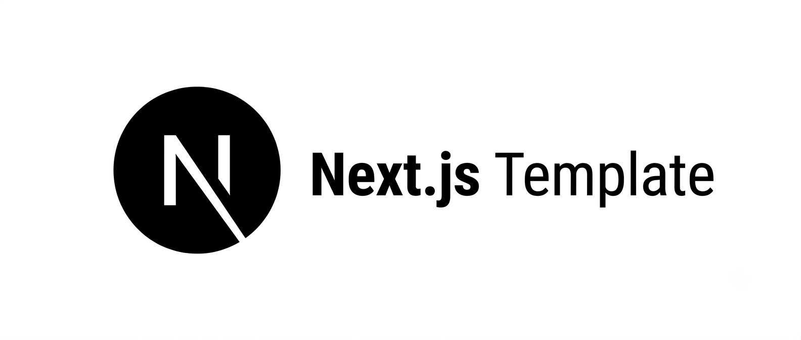

<p align="center">
  
  
  
  
  
  
</p>

A minimal, well-structured, production-ready **Next.js** frontend/service template with App Router,
typed API layer, test-covered, and CI-ready out of the box.

> This is a custom template made by **AzyzHm**.

## Features

- **Next.js 16** with the **App Router**, React 19.2, and TypeScript in strict mode (Turbopack by default)
- **Tailwind CSS 4** for styling
- **Typed API layer**: Route Handlers under `src/app/api` + a typed `fetch` client in `src/lib/api-client.ts`
- **Clear separation of concerns**: UI (`src/components`) / cross-cutting logic (`src/lib`) / shared types (`src/types`) / API routes (`src/app/api`)
- **Full test suite**: unit, integration, and e2e tests in separate folders
  - Unit + integration: **Vitest** + **React Testing Library** + **MSW** (mocked network, no real backend needed)
  - E2E: **Playwright**, run against a real production build
- **GitHub Actions CI**: lint (ESLint, Prettier, `tsc`) → unit/integration tests with coverage → e2e tests → build
- **ESLint flat config** (unified `typescript-eslint` package) + Prettier, with `lint-staged` + `husky` wired for pre-commit checks
- **No authentication or state-management library included**, kept minimal on purpose, so you
  can plug in whatever fits your project (NextAuth, Clerk, Zustand, TanStack Query, etc.)

## Project Structure

```
next-custom-template/
├── .github/
│   ├── workflows/ci.yml        # CI: lint → test (unit/integration) → e2e → build
│   ├── ISSUE_TEMPLATE/          # Bug report + feature request forms
│   ├── dependabot.yml           # Grouped dependency updates
│   └── PULL_REQUEST_TEMPLATE.md
├── public/                      # Static assets (banner, favicon, etc.)
├── src/
│   ├── app/
│   │   ├── layout.tsx           # Root layout
│   │   ├── page.tsx             # Home page
│   │   ├── globals.css          # Tailwind entrypoint + CSS variables
│   │   └── api/v1/health/       # Example Route Handler (GET /api/v1/health)
│   ├── components/
│   │   └── ui/                  # Reusable, presentational UI components
│   ├── lib/
│   │   ├── api-client.ts        # Typed fetch client used by the frontend
│   │   ├── env.ts               # Centralized, validated env var access
│   │   └── utils.ts
│   └── types/                   # Shared, cross-cutting TypeScript types
├── tests/
│   ├── unit/                    # Isolated logic/component tests
│   ├── integration/             # Route handlers + API client, against mocked network (MSW)
│   ├── e2e/                     # Full user flows against a real build (Playwright)
│   ├── mocks/                   # MSW handlers + server setup
│   └── setup/                   # Vitest setup file
├── scripts/                     # lint.sh, test.sh helper scripts
├── eslint.config.mjs
├── vitest.config.ts
├── playwright.config.ts
├── tsconfig.json
├── next.config.ts
└── .env.example
```

## Getting Started

### 1. Clone and install dependencies

```bash
git clone https://github.com/AzyzHm/next-custom-template.git
cd next-custom-template
npm install
```

### 2. Configure environment variables

```bash
cp .env.example .env.local
# then edit .env.local as needed
```

### 3. Run the app

```bash
npm run dev
```

The app will be available at `http://localhost:3000`, with an example API route at
`http://localhost:3000/api/v1/health`.

## Running Tests

```bash
# By type
npm run test:unit
npm run test:integration
npm run test:e2e

# Unit + integration with coverage (same as CI)
npm run test:coverage

# Everything, same as CI
bash scripts/test.sh
```

Unit and integration tests run against mocked network requests (via MSW), no real backend
needed. E2E tests spin up a real production build via Playwright's `webServer` and exercise it
like a browser would.

## Linting & Formatting

```bash
bash scripts/lint.sh
```

This runs `eslint`, `prettier --check`, and `tsc --noEmit`, the same checks enforced in CI.

## Continuous Integration

Every push and pull request to `main` triggers `.github/workflows/ci.yml`, which:

1. Lints (ESLint, Prettier, TypeScript)
2. Runs unit + integration tests with coverage, uploaded as a build artifact
3. Runs e2e tests (Playwright), uploading the HTML report
4. Builds the app

## Adding a New Route / Resource

A typical new page or API resource (e.g. `Product`) touches these layers:

1. `src/app/<route>/page.tsx` the page itself (if it needs a UI)
2. `src/app/api/v1/products/route.ts` Route Handler(s) for the resource
3. `src/types/product.ts` types for the resource (or add to `src/types/index.ts` if shared)
4. `src/lib/api-client.ts` usage call the new endpoint from the frontend via `apiClient`
5. `src/components/` any resource-specific UI components
6. Tests under `tests/unit`, `tests/integration`, and (for full user flows) `tests/e2e`

## Contributing

Contributions are welcome! Please read [CONTRIBUTING.md](CONTRIBUTING.md) for setup steps and PR
guidelines, and note that this project follows a [Code of Conduct](CODE_OF_CONDUCT.md).

## Security

Found a vulnerability? Please see [SECURITY.md](SECURITY.md) for how to report it responsibly.

## License

This project is licensed under the [MIT License](LICENSE).

---

Made with care by **AzyzHm**.
